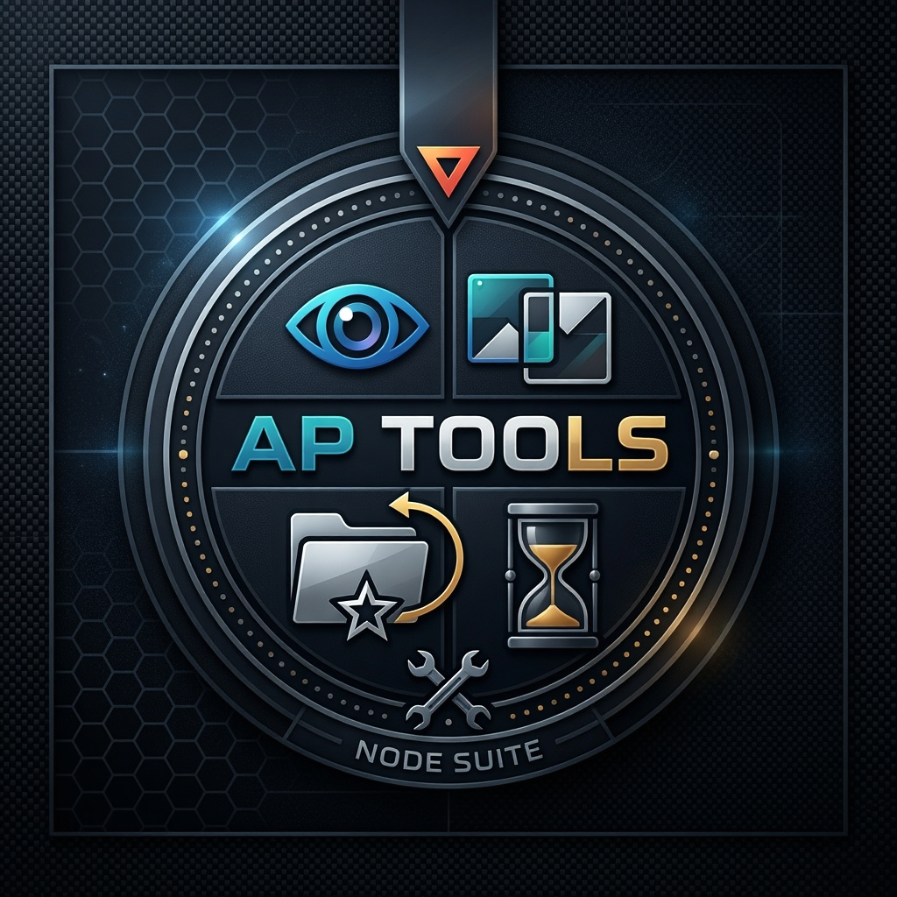
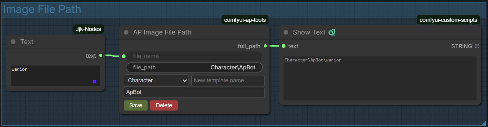
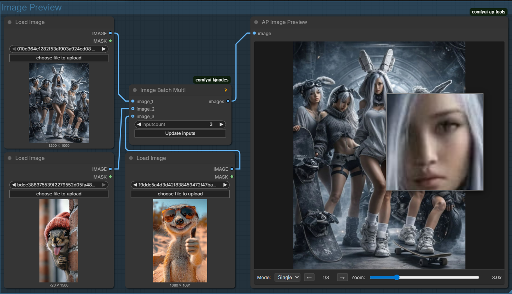
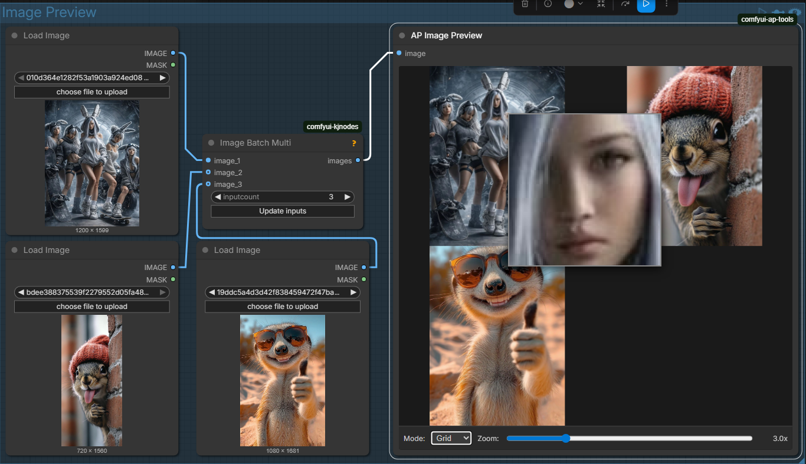
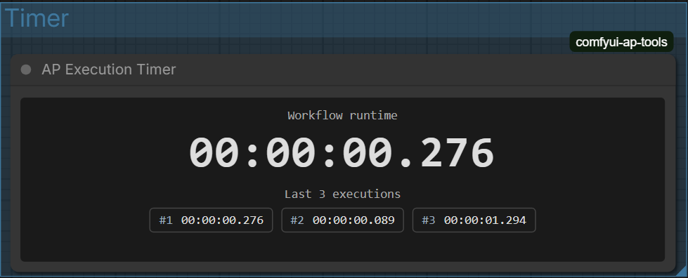

# ComfyUI AP Tools

Набор полезных пользовательских нод для ComfyUI, улучшающих удобство работы с изображениями, путями файлов и временем выполнения.

## 📦 Установка

1. Перейдите в папку `custom_nodes` вашей ComfyUI установки
2. Клонируйте репозиторий:
```bash
git clone https://github.com/your-username/comfyui-ap-tools.git
```
3. Перезапустите ComfyUI
4. Используйте Manager для установки

## ✨ Возможности

Модуль содержит 4 ноды с богатым пользовательским интерфейсом:

---

### 🔧 AP Image File Path
**Категория**: `ap-tools`



Удобный конструктор путей к файлам с поддержкой шаблонов. Позволяет сохранять часто используемые пути и быстро переключаться между ними.

#### Входы:
- `file_name` (STRING): Имя файла без расширения
- `file_path` (STRING): Базовый путь (скрытое поле, управляется UI)

#### Выходы:
- `full_path` (STRING): Полный собранный путь в формате Windows (с обратными слэшами)

#### Особенности:
- ✅ Менеджер шаблонов путей (сохранение/удаление)
- ✅ Автоматическое объединение базового пути и имени файла
- ✅ Поддержка относительных путей
- ✅ Настройки сохраняются в свойствах ноды
- ✅ Минимальный размер ноды: 350x170 пикселей

#### Использование:
1. В поле `file_name` введите имя выходного файла
2. В разделе шаблонов выберите существующий шаблон или создайте новый
3. В поле пути введите относительный путь (он будет добавлен к выбранному шаблону)
4. Полный путь автоматически собирается и передается на выход

---

### 🖼️ AP Image Preview
**Категория**: `ap-tools`




Улучшенный превьювер изображений с поддержкой зума, лупы и режима сетки.

#### Входы:
- `image` (IMAGE): Изображение или батч изображений для превью

#### Выходы:
Нет выходов (только отображение)

#### Особенности:
- ✅ Режимы отображения: Single (одиночное) и Grid (сетка)
- ✅ Навигация по батчу изображений (стрелки ← →)
- ✅ Масштабируемая лупа (зум 1.5x - 8.0x)
- ✅ Автоматическое подгонка размера под ноду
- ✅ Поддержка DPI масштабирования браузера
- ✅ Минимальный размер ноды: 420x460 пикселей
- ✅ Скрывает стандартный вывод ComfyUI

#### Управление:
- **Mode**: Переключение между одиночным режимом и сеткой
- **Zoom**: Изменение степени увеличения лупы
- **← →**: Навигация по изображениям в батче
- **Наведение мыши**: Показывает лупу с увеличенным фрагментом

---

### 🔍 AP Image Compare
**Категория**: `ap-tools`

https://github.com/user-attachments/assets/95954dc6-0af3-4eb9-930e-3bb57473aa06

Инструмент для сравнения двух и более изображений с различными режимами.

#### Входы:
- `image_1` (IMAGE): Первое изображение (обязательно)
- `image_2` (IMAGE): Второе изображение (обязательно)
- `image_3` (IMAGE): Третье изображение (опционально)
- `image_4` (IMAGE): Четвертое изображение (опционально)

#### Выходы:
Нет выходов (только отображение)

#### Особенности:
- ✅ Два режима сравнения: Overlay (наложение) и Split (разделитель)
- ✅ Выбор любых двух изображений для сравнения из 4 входов
- ✅ Регулировка прозрачности при наложении
- ✅ Интерактивный разделитель (перетаскивается мышью)
- ✅ Зумирование и панорамирование
- ✅ Кнопки Center и Reset для быстрого сброса вида
- ✅ Минимальный размер ноды: 520x500 пикселей
- ✅ Колесо мыши для быстрого зума

#### Режимы:
- **Overlay**: Первое изображение на второе с регулируемой прозрачностью
- **Split**: Вертикальный разделитель, который можно перетаскивать для сравнения деталей

---

### ⏱️ AP Execution Timer
**Категория**: `ap-tools`



Таймер времени выполнения воркфлоу с историей последних запусков.

#### Входы:
Нет входов

#### Выходы:
Нет выходов (только отображение)

#### Особенности:
- ✅ Реальное время от начала выполнения до конца
- ✅ История последних 3 запусков
- ✅ Формат времени: `HH:MM:SS.ms`
- ✅ Автоматический старт/стоп при запуске очереди
- ✅ Сохраняет состояние при перезагрузке страницы
- ✅ Минимальный размер ноды: 440x160 пикселей
- ✅ Моноширинный шрифт для удобного чтения

#### Отображение:
- Основной счетчик с точностью до миллисекунд
- Список последних 3 выполнений с номером и временем

---

## 📂 Структура проекта

```
comfyui-ap-tools/
├── __init__.py                # Регистрация нод и API эндпоинтов
├── templates.json             # Хранилище сохраненных шаблонов путей
├── nodes/
│   ├── ap_image_file_path.py  # Логика ноды AP Image File Path
│   ├── ap_image_preview.py    # Логика ноды AP Image Preview
│   ├── ap_image_compare.py    # Логика ноды AP Image Compare
│   └── ap_execution_timer.py  # Логика ноды AP Execution Timer
└── web/js/
    ├── ap_image_file_path.js  # Фронтенд с менеджером шаблонов
    ├── ap_image_preview.js    # Фронтенд превьювера с лупой
    ├── ap_image_compare.js    # Фронтенд сравнения изображений
    └── ap_execution_timer.js  # Фронтенд таймера
```

## 🔌 API Эндпоинты

Модуль предоставляет следующие API методы для работы с шаблонами:

| Метод | Путь                          | Описание
|-------|-------------------------------|-------------------------------------
| GET   | `/ap-tools/templates`         | Получить список имен всех шаблонов
| GET   | `/ap-tools/templates/all`     | Получить все шаблоны с путями
| POST  | `/ap-tools/templates`         | Сохранить новый шаблон
| DELETE| `/ap-tools/templates/{name}`  | Удалить шаблон по имени
| GET   | `/ap-tools/execution-timer/uptime` | Получить время работы ComfyUI

## 💡 Советы по использованию

1. **AP Image File Path** отлично работает вместе с нодами сохранения изображений — используйте выход `full_path` как вход для `filename_prefix`
2. Для сравнения разных вариантов генераций используйте **AP Image Compare** — это значительно быстрее, чем открывать изображения в отдельных программах
3. **AP Execution Timer** помогает оптимизировать воркфлоу — видите, что время выполнения выросло? Значит можно что-то оптимизировать
4. Все ноды автоматически подстраиваются под масштаб интерфейса ComfyUI

## 🛠️ Технические особенности

- Все ноды используют нативные механизмы расширений ComfyUI
- Фронтенд написан на чистом JavaScript без внешних зависимостей
- Шаблоны путей хранятся в файле `templates.json` в корне модуля
- История таймера хранится локально в `localStorage` браузера
- Поддерживается только Windows стиль путей (обратные слэши `\`)
- Изображения для превью и сравнения сохраняются во временную папку ComfyUI

## 📋 Требования

- ComfyUI версии не ниже 0.1.0
- Python 3.8+
- Совместимо с любыми операционными системами (Windows, Linux, macOS)

## 🤝 Поддержка

Если вы нашли баг или хотите предложить улучшение, создайте issue в репозитории.
